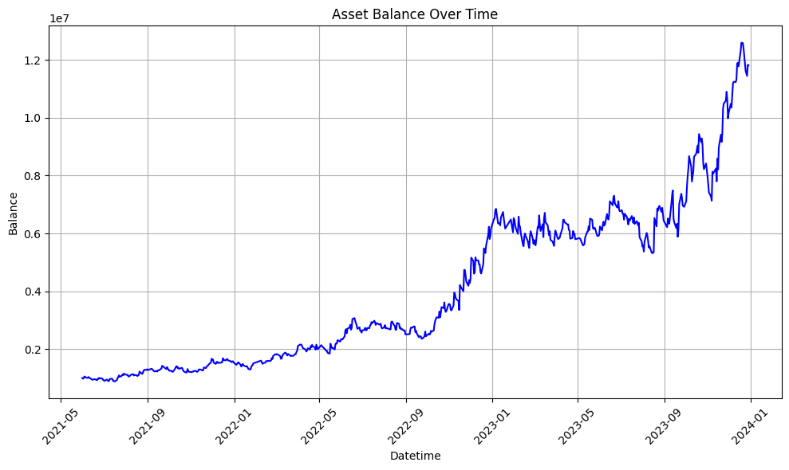
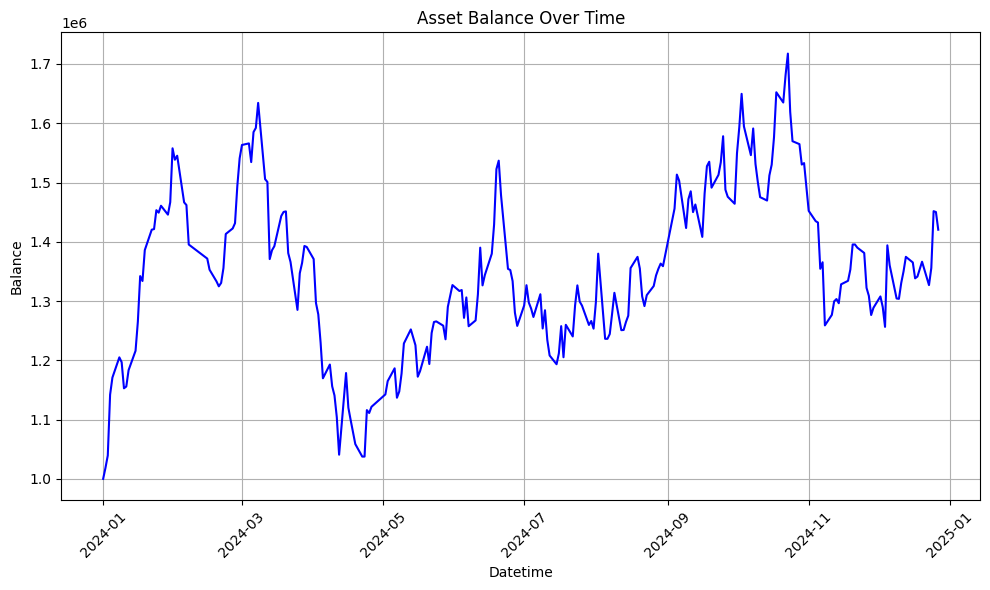
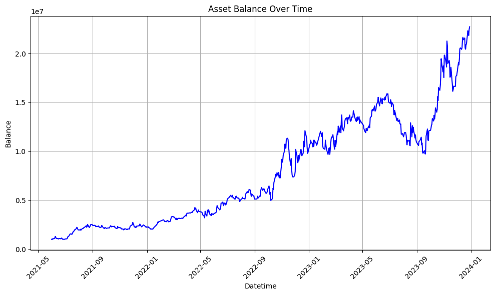
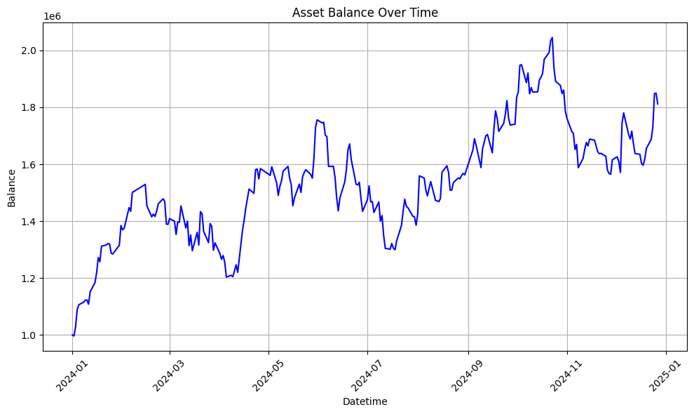
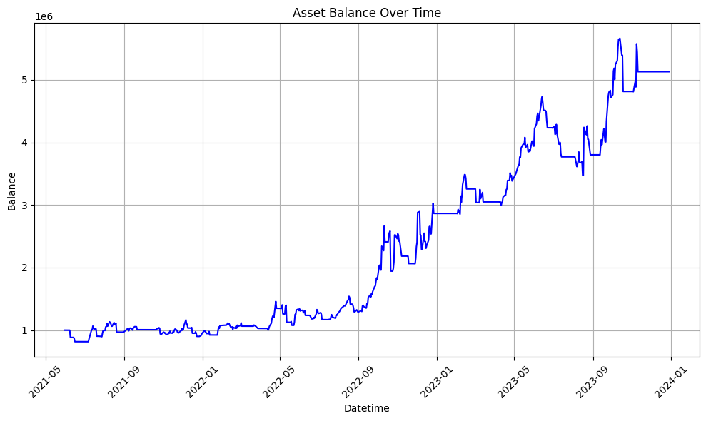
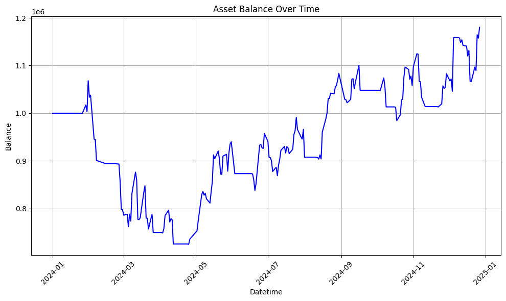

# Mean  Reversion Strategy 
## Hypothesis
 Mean reversion strategies aim to achieve consistent, long-term profits with relatively lower risk
 compared to momentum strategies. However, blindly buying assets below a benchmark is risky, as
 strong momentum continuation can lead to significant losses. To mitigate this, the strategy
 incorporates additional conditions:
 
● Enter a Long position when the price is oversold, begins to show signs of recovery, and
 crosses a specified moving average (MA).
 
 ● Enter a Short position under similar conditions when the price is overbought
 ## Backtesting
 ### 1 Minute 
 **Parameters**
```
{
'cut_loss_thres': 0.007569026464045029,
 'bb_window': 124,
'bb_std': 2.4137146876952342, '
sma_window': 91
}
```
**Result**
-**In Sample**

-**Out Sample**

 ### 5 Minute 
 ```
{
    "cut_loss_thres": 0.009450233005530457,
    "bb_window": 27,
    "bb_std": 1.116167224336399,
    "sma_window": 24
  }
```
**Result**
-**In Sample**

-**Out Sample**

 ### 1 Day

 ```
{
'cut_loss_thres': 0.012670135982914067,
'lookback_period': 289,
'upbound': 0.009367476782809248,
'downbound': -0.06322841969405665,
'sma_window': 97
}
```
**Result**
-**In Sample**

-**Out Sample**

